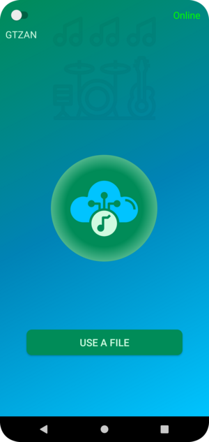
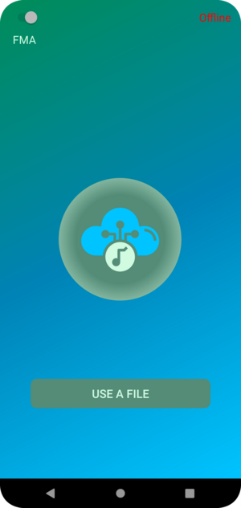
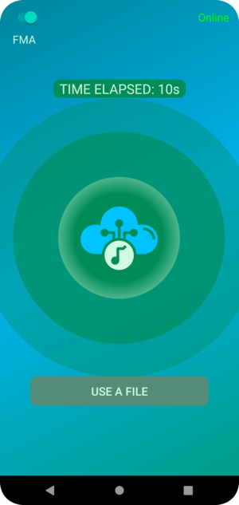
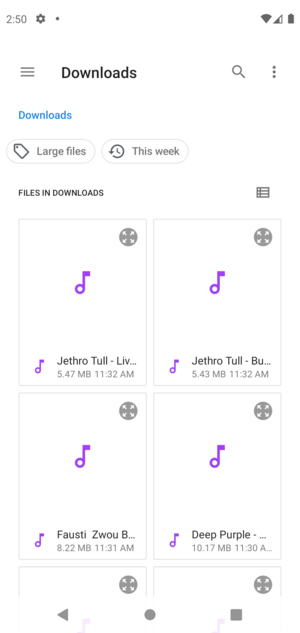
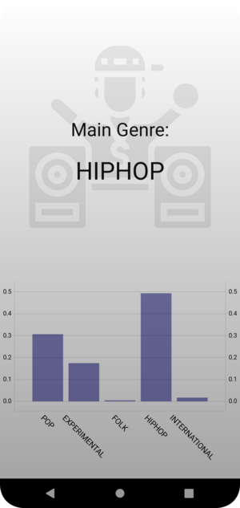

# HFU-BeatBot

The Android App HFU-BeatBot is capable of analysing music by extracting audio features which are sent to a server and are processed by a neural network. The neural network analyzes the song and returns genre probabilities based on the extracted audio features.
The GTZAN model recognizes the following genres: Rock, Pop, Hip-Hop, Reagge, Classic, Country, Metal, Blues, Jazz and Disco. 
The FMA model recognizes the following genres: Electronic, Instrumental, Folk, Experimental, Rock, Hip-Hop, International and Pop.

## Table of Contents

- [Installation](#installation)
- [Usage](#usage)

	- [Analyse a song by recording](#analyse-a-song-by-recording)
	- [Analyse a song in your filesystem](#analyse-a-song-in-your-filesystem)

- [Internal Analyzing Process](#internal-analyzing-process)
- [License](#license)

## Installation

To install the HFU-BeatBot on your Android Device you need to download **HFU-BeatBot.apk** which is located in this repository. Afterwards, you can install the app by tapping on the downloaded .apk file. The app should now be available on your phone.

## Usage

First time use: When you open HFU-BeatBot for the first time, the app will ask you to allow the usage of the microphone and the access to your filesystem. In order for the app to work as expected, the app needs to receive the required permissions. 
There is a status message in the upper right corner, notifying you if the server is online or offline. Should the server be offline, the buttons are greyed out and the app won't take input. There is also a switch in the upper left corner with which the used model (GTZAN / FMA) can be changed, the two models differ in the genres that they can recognize.

### Analyze a song by recording

To analyze a song  with your microphone, press the big round button in the center of your screen, this will make the app record audio. The duration of your recording will be shown above the round button. The app needs at least 7 seconds of recording time to evaluate the audio and the accuracy increases with additional recording time. The maximum allowed time is about 200 seconds.
To end the recording and start evaluation just press the button again. If the duration of the recording was sufficient, the app immediately starts to analyze the recorded audio. After that's done, you get presented with the result screen. The result screen shows the most represented genre along with 4 other top genres, represented by a bar diagram at the bottom of the screen.

### Analyze a song in your filesystem

To analyze a song from your file system (the app only supports .mp3 and .wav file formats), you can choose it by pressing the "USE A FILE" in the bottom portion of the screen. This button opens a window to your filesystem. After choosing a file, the app starts to process it. After it finishes the processing you are immediately forwarded to the result screen.

## Internal Analyzing Process

The internal analyzing process begins by loading the file, in case that it is an mp3 file, the system first converts this file to a .wav file. In the next step, the song is split into 5s parts, every part of the song is then processed by a separate thread, which calculates the MFCC (Mel-Frequency Cepstral Coefficients) values and their standard deviations. These values are then put into JSON format, including the model to be used (FMA or GTZAN), and sent to the server using HTTP. The server then uses the selected neural network to process the input. The neural network returns the probabilities for every genre for every HTTP request, which is then sent back to the app. The app takes this output and calculates the average. The average genre then gets displayed in the result screen with the aforementioned bar diagram and text with the main genre.

## License

This project includes the following libraries with their respective licenses:

1. GSON, JLayer, and MPAndroidChart - Apache License 2.0

2. JLibrosa - MIT License

3. JLayer - GNU LGPL

